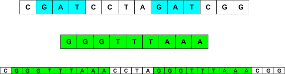
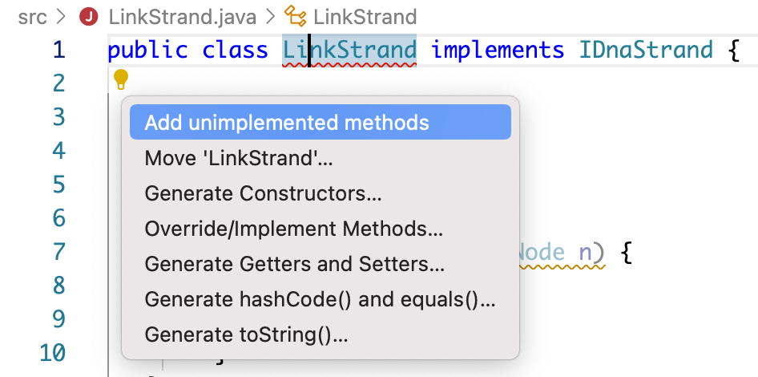
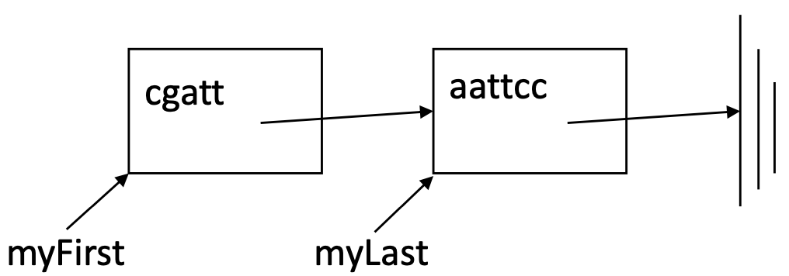
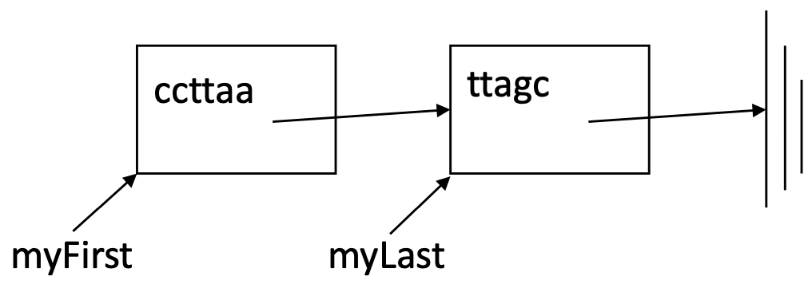

# Project 3: DNA

This is the directions document for Project 3 DNA in CompSci 201 at Duke University, Spring 2023. [This document details the workflow](https://coursework.cs.duke.edu/cs-201-spring-23/resources-201/-/blob/main/projectWorkflow.md) for downloading the starter code for the project, updating your code on coursework using Git, and ultimately submitting to Gradescope for autograding.

## Outline
- [Background and Introduction](#project-background-and-introduction)
- [Part 1: Running DNABenchmark, Profiling, Analysis](#part-1-running-dnabenchmark-profiling-analysis)
- [Part 2: Programming](#part-2-programming-linkstrand)
- [Part 3: More Benchmarking and Analysis](#part-3-more-benchmarking-and-analysis)
- [Submitting and Grading](#submitting-and-grading)

## Project Background and Introduction

In this assignment you'll experiment with different implementations of a simulated [restriction enzyme cutting](https://en.wikipedia.org/wiki/Restriction_enzyme) (or cleaving) of a DNA molecule. In this context, you will study the application of the linked list data structure toward a real world problem in scientific computing.

Specifically, you will develop a `LinkStrand` class, an implementation of the `IDnaStrand` interface that uses an internal linked list to model recombinant DNA. Your implementation will be more efficient for modeling DNA splicing operations than using a String or StringBuilder (as in the provided `StringStrand` and `StringBuilderStrand` classes respectively, which provide correct but less efficient implementations of the `IDnaStrand` interface). You will benchmark and analyze the efficiency improvements of the `LinkStrand` implementation over those provided in the starter code when conducting simulations of gene splicing experiments.

The simulation coded here is a simplification of the chemical process, but provides an example of the utility of linked lists as a data structure for certain algorithmic processes.

<details>
<summary>Optional Historical Details</summary>

[Three scientists shared the Nobel Prize](http://nobelprize.org/nobel_prizes/medicine/laureates/1978/press.html) in 1978 for the discovery of restriction enzymes. They're also an essential part of the process called [PCR polymerase chain reaction](http://en.wikipedia.org/wiki/Polymerase_chain_reaction) which is one of the most significant discoveries/inventions in chemistry and for which Kary Mullis won the Nobel Prize in 1993.

Kary Mullis, the inventor of PCR, is an interesting character. To see more about him see this archived copy of a [1992 interview in Omni Magazine](http://web.archive.org/web/20010121194200/http://omnimag.com/archives/interviews/mullis.html) or his [personal website](http://karymullis.com/) which includes information about his autobiography Dancing Naked in the Mind Field, though you can read this free [Nobel autobiography](https://www.nobelprize.org/prizes/chemistry/1993/mullis/biographical/) as well.
 
</details>

### DNA strands and the Starter Code

For the purposes of this project, DNA is represented as a sequence of characters, specifically `a`, `c`, `g`, and `t` for the four chemical bases of DNA. There can be a *lot* of these bases in a DNA sequence, so efficiency matters when dealing with DNA data computationally. This project includes a `data/` folder containing two data files: `ecoli.txt` and `ecoli_small.txt`, which represent the genetic information of ecoli - there are over 4.6 million bases in the full sequence in `ecoli.txt` and over 320 thousand in the `ecoli_small.txt` subsequence.

To get started you should read the comments in the `IDnaStrand` interface to understand what functionality implementations of that interface should provide with respect to manipulating DNA data. You will note that some methods in the interface have a `default` implementation provided, but most do not -- these are the methods you will be implementing. The `default` method `cutAndSplice` is the one that is benchmarked by the code provided in `DNABenchmark`, see [Part 1](#part-1-running-dnabenchmark-profiling-analysis) for a discussion of that method and its complexity.

Two relatively straightforward implementations of the `IDnaStrand` interface are provided in the starter code. `StringStrand` represents a DNA sequence as a simple String. `StringBuilderStrand` represents a DNA sequence as a  [`StringBuilder`](https://docs.oracle.com/en/java/javase/17/docs/api/java.base/java/lang/StringBuilder.html). You can look at these two classese to see simple and correct (but not necessarily efficient) implementations of the functionality specified in the `IDnaStrand` interface.

## Part 1: Running DNABenchmark, Profiling, Analysis

You can do this Part 1 without writing any linked list code. We encourage you do this before starting on Part 2 of the assignment where you will program a linked list.

### `cutAndSplice` Simulation Complexity with `StringStrand` an `StringBuilderStrand`

The `main` method of `DNABenchmark` simulates a DNA splicing experiment represented by the `cutAndSplice` method (implemented in `IDnaStrand` with complexity that depends on which implementation of the interface is being used). The expandable section below describes what this method simulates and how to reason about its complexity using the provided starter implementations `StringStrand` and `StringBuilderStrand`.

<details>
<summary>Complexity of cutAndSplice</summary>

The method `cutAndSplice` is not a mutator. It starts with a strand of DNA and creates a new strand by finding each and every occurrence of a restriction enzyme like `“gaattc”` and replacing this enzyme by a specified splicee -- another strand of DNA. If `dna` represents the strand `"cgatcctagatcgg"` then the call 

```java
dna.cutAndSplice("gat", "gggtttaaa")
```

would result in returning a new strand of DNA in which each occurrence of `"gat"` in `dna` is replaced by `"gggtttaaa"` -- as shown in the diagram below where the original strand is shown first, with the enzyme `"gat"` shaded in blue and the splicee `"gggtttaaa"` shaded in green. 

<div align="center">
  
</div>

The diagram illustrates how `cutAndSplice` works with both `StringStrand` and `StringBuilderStrand`. Each is a strand of 14 characters in which the restriction enzyme `"gat"` occurs twice, is replaced by `"gggtttaaa"`, resulting in creating and returning a new strand that contains 26 characters.

Note that if the original strand has size N, then the new strand has size N + b(S-E) where b is the number of breaks, or occurrences of the enzyme, S is the length of the splicee and E is the length of the enzyme. If we assume the splicee is large, as it will be when benchmarking, we can ignore E and this becomes approximately N + bS, the size of the recombinant new strand in terms. 

The runtime and memory complexity for `cutAndSplice` can be expressed as a function of N, b, and S. The complexity also depends on the implementation used for the `IDnaStrand` interface. Of particular importance for the runtime complexity is the efficiency of the `append` method, which you will note is called repeatedly by `cutAndSplice`. For the memory complexity, the question is how the implementation represents the resulting recombinant Strand.

</details>

### Benchmarking `StringStrand` and `StringBuilderStrand`

You'll need to run the `main` method of the `DNABenchmark` twice, once for the `StringStrand` implementation of the `IDnaStrand` interface and once for the `StringBuilderStrand` implementation. By default, the program will benchmark the runtime of `cutAndSplice` on the `ecoli_small.txt` dataset. Make sure to save your results for answering analysis questions later. Details in the expandable section below.

<details>
<summary>Expand for details on running DNABenchmark</summary>
You select which implementation to use changing the value of the static instance variable `strandType` at the top of the class file. Note that the `StringStrand` class may take several seconds to run on `ecoli_small.txt`. `StringBuilderStrand` can scale to `ecoli.txt`, but you may not want to run `StringStrand` on the larger data set as it may take several minutes to run.

The main method benchmarks the average time (over several trials)  in milliseconds that it takes to run `cutAndSplice` for different values of N (the size of the original dna strand), b (the number of breaks / occurrences of the `enzyme`), and S (the size of the `splicee`). It also shows the size of the resulting recombininant new Strand, labeled as `recomb`, which is roughly equal to N + bS. 

First it performs several runs increasing S while holding the other values constant. Then it performs several runs increasing N and b while holding S constant. Example runs from an instructor's computer on `ecoli_small.txt` are shown below (note that your timings may differ but should show similar trends).
</details>

<details>
<summary>StringStrand DNABenchmark Example Results</summary>

```
dna length = 320,160
cutting at enzyme gaattc
----------------------------------------------------------------------
Class             dna,N   splicee,S        recomb  time(ms)  breaks,b
----------------------------------------------------------------------
StringStra:     320,160      10,000       769,890        13        45
StringStra:     320,160      20,000     1,219,890        13        45
StringStra:     320,160      40,000     2,119,890        14        45
StringStra:     320,160      80,000     3,919,890        26        45
StringStra:     320,160     160,000     7,519,890        49        45
StringStra:     320,160     320,000    14,719,890       105        45
StringStra:     320,160     640,000    29,119,890       239        45
StringStra:     320,160   1,280,000    57,919,890       481        45
StringStra:     320,160      10,000       769,890         6        45
StringStra:     640,320      10,000     1,539,780        21        90
StringStra:   1,280,640      10,000     3,079,560        84       180
StringStra:   2,561,280      10,000     6,159,120       322       360
StringStra:   5,122,560      10,000    12,318,240     1,449       720
```

</details>

<details>
<summary>StringBuilderStrand DNABenchmark Example Results</summary>

```
dna length = 320,160
cutting at enzyme gaattc
----------------------------------------------------------------------
Class             dna,N   splicee,S        recomb  time(ms)  breaks,b
----------------------------------------------------------------------
StringBuil:     320,160      10,000       769,890         1        45
StringBuil:     320,160      20,000     1,219,890         1        45
StringBuil:     320,160      40,000     2,119,890         1        45
StringBuil:     320,160      80,000     3,919,890         1        45
StringBuil:     320,160     160,000     7,519,890         2        45
StringBuil:     320,160     320,000    14,719,890         3        45
StringBuil:     320,160     640,000    29,119,890         6        45
StringBuil:     320,160   1,280,000    57,919,890         8        45
StringBuil:     320,160      10,000       769,890         1        45
StringBuil:     640,320      10,000     1,539,780         1        90
StringBuil:   1,280,640      10,000     3,079,560         3       180
StringBuil:   2,561,280      10,000     6,159,120         7       360
StringBuil:   5,122,560      10,000    12,318,240        15       720
```

</details>

## Part 2: Programming LinkStrand

This section details how to implement the `LinkStrand` class.

### LinkStrand implements IDnaStrand

You will create a new class named `LinkStrand` from scratch. Start by creating a `LinkStrand.java` file in the `src` folder of the project. This class must implement the `IDnaStrand` interface as shown in the class header below:

```java 
public class LinkStrand implements IDnaStrand
```

VS Code will then indicate that the code will not compile. If you select the light bulb / suggestion button as indicated in the figure below, it should give you as the first suggestion to "add unimplemented methods." This will automatically generate method stubs for all of the methods in the `IDnaStrand` interface that any implementing class must provide. Of course, you can also add these method stubs yourself manually.

<div align="center">
  
</div>
 
In addition, you need to implement two constructors as described below. The constructors and methods don't need to be implemented in the order shown, but the simpler methods are listed first. These methods are tested in the `TestStrand` class.

You should test each method as you implement it using the `TestStrand` JUnit test class. You'll need to change the type of strand returned in that JUnit class method `getNewStrand` to test your class. It's unlikely that any tests will work until you've implemented `LinkStrand.toString()`.

#### 1. `LinkStrand` State, Constructors and `initialize` Method
Implement two constructors: one with no parameters (the default constructor) and one with a `String` parameter. The constructors work by calling the required initialize method. Refer to `StringStrand.java` for an example to adapt. Implement the initialize method that initializes the `LinkStrand` object with a `String`.

<details>
<summary>Details on LinkStrand State, Constructors and initialize Method</summary>

You should start by defining a `private` inner `Node` class (that is, defined inside of the `LinkStrand` class) that defines a node in the `LinkStrand`. Each such node should store at least a `String` (referred to as `info` in this writeup) and a reference to the next node in the list. You will also need to define a constructor for your inner class.

After you have defined your node class, you should use the following instance variables definitions for the `ListStrand` class.

```java
private Node myFirst, myLast;
private long mySize;
private int myAppends;
private int myIndex;
private Node myCurrent;
private int myLocalIndex;
```

**All constructors and methods must maintain the following class invariants:**
1. `myFirst` references the first node in a linked list of nodes.
2. `myLast` references the last node in a linked list of nodes.
3. `mySize` represents the total number of characters stored in all nodes together.
4. `myAppends` is the number of times that the append method has been called. It would be useful to think of this as one less than the number of nodes in the linked list.

The following instance variables will be updated in `charAt()`:
1. `myIndex` tracks the last character we accessed with the `charAt()` method. Initialize this as `0`.
2. `myCurrent` tracks the last node holding the character at position `myIndex`. Initialize this as `myFirst`.
3. `myLocalIndex` tracks the last character we accessed within the `Node`. Initialize `this` as `0`.

Initially, when the `LinkStrand("cgatt...")` constructor is called  (though the `String` parameter can be any string) there will be a single node in the linked list that represents the DNA strand `"cgatt…"`. (The only way to have more than one node in a `LinkStrand` internal linked-list is by calling `.append`.)

<div align="center">
  
</div>

As described above, you'll create two constructors. The string constructor should consist of one call to initialize which establishes the class invariant with a single node representing the entire strand of DNA as illustrated. The no-argument constructor, also called the default constructor, should have one line: `this("")` which calls the other constructor with a String parameter of `""`. 

The `initialize` method will maintain the class invariants when it's called. There will be a single node created after `initialize` is called.

</details>

#### 2. Implementing the `getInstance` and `size` Methods
Implement the `getInstance` method that works similarly to what you see in `StringStrand` and `StringBuilder` strand. This must return a `LinkStrand` object. 

Implement `size`. This should be a single line getter method and must run in `O(1)` time.

#### 3. Implementing the `append` and `getAppendCount` Methods 
Implement `append` which creates one new node and updates instance variables to maintain class invariants as described in the details below. Implement `getAppendCount`. This should be a single line and must run in `O(1)` time.

<details>
<summary>Details on Implementing the append and getAppendCount Methods</summary>

The `append` method should add one new node to the end of the internal linked list and update state to maintain the invariant. For example, suppose that these two statements are both executed:

```java
LinkStrand dna = new LinkStrand("cgatt");
dna.append("aattcc");
```
<div align="center">
  
</div>

The internal linked list maintained by `LinkStrand` after the first call is diagrammed above. After the call to append we have the following picture:

Note that maintaining the class invariant after this call to append would require:
1. `myFirst` doesn't change
2. `myLast` changes to point to the new node added
3. `mySize` is incremented by six
4. `myAppends` is incremented by one (because a new node is added).

Note that `.append` returns an `IDnaStrand` object. This is the object that was just modified/appended to. However, the method append does not create a new `IDnaStrand` object. The `.append` method is a mutator -- it changes the internal state of the `IDnaStrand` object on which it's invoked, and then returns this `LinkStrand` object itself. Look carefully at both `StringStrand` and `StringBuilderStand` strand to see what to return.

Note that after implementing `append`, the method `getAppendCount` should return the correct result, the value of instance variable `myAppends` that's maintained by the class invariants and initialized/updated in `initialize` and `append`.
</details>


#### 4. Implementing the `toString` Method
Implement `toString`. This returns the `String` representation of the `LinkStrand` by looping over nodes and appending their values to a `StringBuilder` object. The method should run in `O(N)` time.

<details>
<summary>Details on Implementing the toString Method</summary>

The `toString` method returns the `String` representation of the entire DNA strand. Conceptually this is a concatenation of the `String` stored in each node.

This method should use a standard `while` loop to visit each node in the internal linked list. The method creates and updates a single `StringBuilder` object by appending each `node.info` field to a `StringBuilder` object that's initially empty. The final return from `LinkStrand.toString` will simply be returning the result of calling `.toString()` on the `StringBuilder` object.

For more guidance on `StringBuilder`, see the [Java Documentation here](https://docs.oracle.com/en/java/javase/17/docs/api/java.base/java/lang/StringBuilder.html). 

You should be able to test all the methods implemented to this point using the class `TestStrand`. The testing methods in `TestStrand` rely on `.toString` being correct, so after implementing `.toString` you may find errors in your other methods as a result of testing.

</details>

#### 5. Implementing the `reverse` Method
Implement `reverse` to return a new `LinkStrand` object that's the reverse of the object on which it's called. **This method is not a mutator, it creates a new `LinkStrand`.**

<details>
<summary>Details on Implementing the reverse Method</summary>

This method creates a new `LinkStrand` object that is the reverse of the object on which it's called. The reverse of `"cgatccgg"` is `"ggcctagc"`. This method returns a new strand; **it does not alter the strand on which it's called**, i.e., it's not a mutator. 

You should create a new linked list with nodes in reverse order, and each string in each node also reversed. Put differently: The reversed `LinkStrand` you return should have the same number of nodes as the original `LinkStrand`, but in reverse order; each internal node should also contain the reversed `String` of the corresponding node in the original `LinkStrand`. 

For example, if the original `LinkStrand` looks like
<div align="center">
  
</div>
then the `LinkStrand` returned by `reverse` should look like the following:
<div align="center">
  
</div>
with no changes to the original.

The easiest way (and an efficient way) to reverse a `String` in Java is to use [`StringBuilder` and the `reverse` method](https://docs.oracle.com/en/java/javase/17/docs/api/java.base/java/lang/StringBuilder.html#reverse()).

Be sure to update all instance variables of the new reversed `LinkStrand` you are creating to be correct before it is returned.

</details>

#### Implementing the `charAt` Method
Implement `charAt` which returns the character at a specific index. This method requires new instance variables *to meet performance characteristics.*

<details>
<summary>Details on Implementing the charAt Method</summary>

This method returns the character at the specified index if that's a valid index, and throws an `IndexOutOfBoundsException` otherwise. A naive implementation of this method would start at the beginning of the linked list, the node referenced by `myFirst` and count characters until the `index`-th character is found. Note that you will need to loop *both* through the nodes, *and* through the characters within each node. 

For full credit, your `charAt` method should be more efficient. Specifically, you should maintain *state* (in this case, storing information in instance variables) so that after a call of `charAt(k)` the call of `charAt(k+1)` is constant time operation.

To do this, you should appropriately update the following  instance variables: one for the current node in a sequence of calls of charAt, one for the current index into that node, and one for the overall count; these are explained below. 

- `myIndex` is the value of the parameter in the last call to `charAt`. This means that if a call to `s.charAt(100)` is followed by `s.charAt(101)` the value of `myIndex` will be 100 after `s.charAt(100)` executes and 101 after `s.charAt(101)` executes.
- `myLocalIndex` is the value of the index within the string stored in the node last-referenced by `charAt` when the method finishes. For example, suppose a strand consists of three nodes: the first has 60 characters; followed by a node of 30 characters; followed by a node of 40 characters. The call `s.charAt(40)` will mean that `myIndex` is 40 and `myLocalIndex` is also 40 since that's the index within the first node of the list, where the character whose index is 40 is found.  Suppose this is followed by `s.charAt(70).` The character at index 60 of the entire strand will be the character with index zero of the second node -- since the first node holds characters with indexes 0-59 since its info field is a string of 60 characters. The character at index 70 of the entire strand will be the character with index 10 of the second node. This means that after the call `charAt(70)` the value of `myIndex` will be 70, the value of `myLocalIndex` will be 10, and the value of `myCurrent` (see just below) is a pointer to the second node of a three-node list.

<div align="center">
  
</div>

- `myCurrent` is the node of the internal list referenced in the last call to `charAt`. In the example above the value of `myCurrent` would be the first node after the call `s.charAt(40)`, would be the second node after the call `s.charAt(70)` or `s.charAt(89)`, and would be the third node after the call `s.charAt(90)` since the first two nodes only contain a total of 90 characters, with indexes 0 to 89.


##### Why do we need charAt to be efficient?
If the `charAt` method is not efficient, the loop below will be `O(N^2)` since the `charAt` method will be `O(k)` to access the kth character.

```java
LinkStrand dna = new LinkStrand(".....");
StringBuilder s = new StringBuilder("");
for(int k=0; k < dna.size(); k++) {
    s.append(dna.charAt(k));
}
```

This `charAt` method is called by the code in the `CharDnaIterator` class. So iterating over an `IDnaStrand` object will ultimately use the `charAt` method as shown in the code below. 

```java
LinkStrand dna = new LinkStrand(".....");
Iterator<Character> iter= dna.iterator();
for(char ch : iter) {
    System.out.print(ch);
}
System.out.println();
```

The `Iterator` object in the code above is constructed as a result of calling the default `IDnaStrand.iterator` method, the body is shown here: 

```java
return new CharDnaIterator(this);
```

Note that the `IDnaStrand` object referenced by this is then stored in the `CharDnaIterator` object being created. 

You only need to implement `charAt`, then all the code described and shown above will work correctly! You will need to initialize the instance variables too.

##### Order of Calls Matters
However, *you'll need to write code to deal with calls that aren't "in order".* If the call `.charAt(100)` is followed by the call `.charAt(30)` you'll need to start at the beginning of the internal linked list to find the character with index 30. If `.charAt(100)` is followed by `.charAt(350)` you won't start at the first node, but continue with the values stored in the instance variables.

</details>


## Part 3: More Benchmarking and Analysis

In [Part 1](#part-1-running-dnabenchmark-profiling-analysis) you benchmarked the complexity of the `cutAndSplice` method of the `IDnaStrand` interface using two implementations of that interface provided in the starter code: `StringStrand` and `StringBuilderStrand`. You did this using the main method of `DNABenchmark`. Review the details there for how to run these benchmarks and what they mean.

Now that you have completed your implementation of `LinkStrand`, you should run the  `DNABenchmark` using the `LinkStrand` implementation of the `IDnaStrand` interface. Again use the `ecoli_small.txt` file. Remember to save your results. Once you finish, you should have a total of 3 benchmark results: one for each of the three implementations (`StringStrand`, `StringBuilderStrand`, and `LinkStrand`).

Recall that `DNABenchmark` simulates a splicing experiment with DNA data. The complexity of the `StringStrand` and `StringBuilderStrand` implementations was discussed earlier in [Part 1](#part-1-running-dnabenchmark-profiling-analysis). Expand below for some discussion of the complexity using the `LinkStrand` implementation.

<details>
<summary> Complexity of cutAndSplice with LinkStrand</summary>

Recall our earlier example: If `dna` represents the strand `"cgatcctagatcgg"` then the call 

```java
dna.cutAndSplice("gat", "gggtttaaa")
```

would result in returning a new strand of DNA in which each occurrence of the enzyme/strand `"gat"` in the object `dna` is replaced by the splice, `"gggtttaaa"`. 

For this example, the `LinkStrand` result is diagrammed below.

<div align="center">
  
</div>

Each time the original strand, a single string, is cut/spliced a new node is created. The new nodes for the `splicee` can all have `String info` referencing the same `String` object in memory, as shown in the diagram for the second and fourth nodes. These represent the first and second occurrences of `"gat"`, respectively. Note that this means `LinkStrand` only needs to represent the `splicee` string once, however many times it is being spliced in / however many breaks there are.

This diagram represents the final `LinkStrand` object after a cut-and-splice operation. That strand is created by the `default cutAndSplice` implementation that calls `toString`, `getInstance`, and `append` which in `LinkStrand` ultimately result in a sequence of nodes as shown here --- mostly because of how `append` works.

</details>

### Analysis Questions

Once you have completed benchmarking, answer the following analysis questions. **Include your answers in the PDF you submit to the analysis assignment for Project 3 in Gradescope.** You can and should complete most of these questions even if you are unable to complete the code for the `LinkStrand` class.

The following questions refer to the parameters:
- N: the size of the original dna strand,
- b: the number of breaks / occurrences of the `enzyme`, and 
- S: the size of the `splicee`.  

Several questions refer to the runtime complexity of the `cutAndSplice` method. You may assume the following about this method:
- The `split` method is O(N).
- The size of the enzyme is negligibly small, i.e., you can ignore subtracting the size of the enzymes from the length/runtime of the results.
- The fragments are all approximately the same length, roughly N/b.

**Question 1:** What is the big O asymptotic runtime complexity of `cutAndSplice` when using `StringStrand`, in terms of N, b, and S? Justify your answer in theory, referencing the implementation, and empirically, by reporting and discussing your results from running `DNABenchmark`. Do you empirical results match your theoretical expectations? Briefly explain.

**Question 2:** What is the big O asymptotic runtime complexity of `cutAndSplice` when using `StringBuilderStrand`, in terms of N, b, and S? Justify your answer in theory, referencing the implementation, and empirically, by reporting and discussing your results from running `DNABenchmark`. Do your empirical results match your theoretical expectations? Briefly explain.

**Question 3:** If each character of a `String` takes 1 byte of memory to store, about how much total memory is necessary to store the result of a `cutAndSplice` operation on a `StringStrand` object? Express your answer in terms of N, b, and S. Would the result take more or less memory if using a `StringBuilderStrand` object? Briefly explain.

**Question 4:** What is the big O asymptotic runtime complexity of `cutAndSplice` when using `LinkStrand` in terms of N, b, and S? Justify your answer in theory, referencing the implementation, and empirically, by reporting your results from running `DNABenchmark`. Do you empirical results match your theoretical expectations? Briefly explain.

**Question 5:** If each character of a `String` takes 1 byte of memory to store, and each reference to a node takes 8 bytes of memory to store, about about how much total memory is necessary to store the result of a `cutAndSplice` operation on a `LinkStrand` object? Express your answer in terms of N, b, and S. Briefly explain your answer, refereincing the implementation of `LinkStrand`. 

## Submitting and Grading 

You will submit the assignment on Gradescope. You can access Gradescope through the tab on Sakai. Please take note that changes/commits on GitLab are NOT automatically synced to Gradescope. You are welcome to submit as many times as you like, only the most recent submission will count for a grade.

Don't forget to upload a PDF for the analysis part of this assignment and mark where you answer each question. This is a separate submission in Gradescope.
